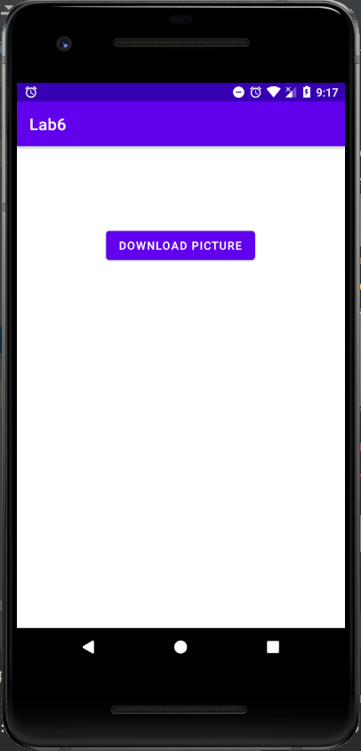
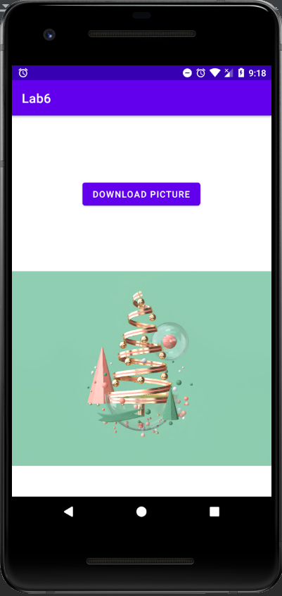

# Лабораторная работа №6. Многопоточные Android приложения.
## Цели
Получить практические навыки разработки многопоточных приложений:
   1) Организация обработки длительных операций в background (worker) thread:
      - Запуск фоновой операции (coroutine/asynctask/thread)
      - Остановка фоновой операции (coroutine/asynctask/thread)
   2) Публикация данных из background (worker) thread в main (ui) thread.

Освоить 3 основные группы API для разработки многопоточных приложений:
   - Kotlin Coroutines
   - AsyncTask
   - Java Threadsй

## Программа работы
#### Задача 1. Альтернативные решения задачи "не секундомер" из Лаб. 2
**1) Java Threads** 
За основу данного решения был взят код из лабораторной №2. В нем была добавлена проверка для работы текущего потока с использованием isInterrupted(), то есть пока поток не прерван, счетчик продолжает считать (если он на экране). Так же добавлена проверка на "уход" приложения с экрана - значение false переменной onScreen приводит к вызову метода interrupt(), прерывающего текущий поток. Обновленный код приведен ниже.
```
const val WATCH_STATE = "watch_state"
private const val TAG = "MainActivity"
var k = 0

class TimerThreads : AppCompatActivity() {
    private var secondsElapsed: Int = 0
    private var onScreen = true

    private var backgroundThread = Thread {
        k += 1
        Log.d(TAG, "Thread $k created")
        while (!Thread.currentThread().isInterrupted) {
            Thread.sleep(1000)
            if (onScreen) {
                textSecondsElapsed.post {
                    textSecondsElapsed.text = "Seconds elapsed: " + secondsElapsed++
                }
            } else {
                Thread.currentThread().interrupt()
                Log.d(TAG, "Thread ${k - 1} interrupted")
            }
        }
    }

    override fun onCreate(savedInstanceState: Bundle?) {
        super.onCreate(savedInstanceState)
        setContentView(R.layout.activity_main)

        if (savedInstanceState != null) {
            secondsElapsed = savedInstanceState.getInt(WATCH_STATE, 0)
        }
    }

    override fun onStart() {
        backgroundThread.start()
        onScreen = true
        super.onStart()
    }

    override fun onStop() {
        onScreen = false
        super.onStop()
    }

    override fun onSaveInstanceState(outState: Bundle) {
        super.onSaveInstanceState(outState)
        outState.putInt(WATCH_STATE, secondsElapsed)
    }
}
```
С использованием выводов в Logcat
 было проверено, что при перезапуске Activity (например при повороте экрана) создается только 1 новый поток.
 
 **2) AsyncTask**
 Использование AsyncTask заключается в наследовании данного класса и переопределении его методов (в данном случае: doInBackground(), выполняющийся в фоновом потоке и отвечающий за выполнение основных задач, и onProgressUpdate(), который синхронизируется с потоком GUI и позволяет выводить актуальные обновления выполняемого процесса). В методе doInBackground(), если задача выполняется, отсчитываются секунды и вызывается publishProgress(), передающий актуальные данные по выполняемому процессу методу onProgressUpgrade(), в котором накручивается значение счетчика и выводится на экран. В методах onStart() и onStop() теперь создается и запускается (execute())новая задача, а затем завершается (cancel(true)). Полный код приведен ниже.
 ```
class TimerAsyncTask : AppCompatActivity() {
    private var secondsElapsed: Int = 0
    private lateinit var asyncTask: MyAsyncTask

    override fun onCreate(savedInstanceState: Bundle?) {
        super.onCreate(savedInstanceState)
        setContentView(R.layout.activity_main)

        if (savedInstanceState != null) {
            secondsElapsed = savedInstanceState.getInt(WATCH_STATE, 0)
        }
    }

    override fun onStart() {
        asyncTask = MyAsyncTask()
        asyncTask.execute()
        super.onStart()
    }

    override fun onStop() {
        asyncTask.cancel(true)
        super.onStop()
    }

    override fun onSaveInstanceState(outState: Bundle) {
        super.onSaveInstanceState(outState)
        outState.putInt(WATCH_STATE, secondsElapsed)
    }

    inner class MyAsyncTask : AsyncTask<Void, Void, Void>() {
        override fun doInBackground(vararg params: Void?): Void? {
            while (!isCancelled) {
                TimeUnit.SECONDS.sleep(1)
                publishProgress()
            }
            return null
        }

        override fun onProgressUpdate(vararg values: Void?) {
            super.onProgressUpdate(*values)
            textSecondsElapsed.text = "Seconds elapsed: " + secondsElapsed++
        }
    }
}
 ```
 
  **3) Kotlin Coroutines**
  Использование корутин в решении данной задачи сводится к созданию области действия кортутины и привязка ее к основному потоку (для возможности взаимодействия с пользовательским интерфейсом). Как и в предыдущих пунктах, все действия происходят при появлении приложения на экране и исчезновении с него. В методе onStart() с помощью launch запускается корутина, не блокирующая текущий поток, в которой каждую секунду накручивается значение счетчика, как и в предыдущих пунктах. В методе onStop() выполнение корутины отменяется. Код программы приведен ниже.
  ```
  class TimerCoroutines : AppCompatActivity() {
    private var secondsElapsed: Int = 0
    private lateinit var coroutine: Job
    private val scope = CoroutineScope(Dispatchers.Main)

    override fun onCreate(savedInstanceState: Bundle?) {
        super.onCreate(savedInstanceState)
        setContentView(R.layout.activity_main)

        if (savedInstanceState != null) {
            secondsElapsed = savedInstanceState.getInt(WATCH_STATE, 0)
        }
    }

    override fun onStart() {
        coroutine = scope.launch {
            while (true) {
                delay(1000)
                textSecondsElapsed.text = "Seconds elapsed: " + secondsElapsed++
            }
        }

        super.onStart()
    }

    override fun onStop() {
        super.onStop()
        coroutine.cancel()
    }

    override fun onSaveInstanceState(outState: Bundle) {
        super.onSaveInstanceState(outState)
        outState.putInt(WATCH_STATE, secondsElapsed)
    }
}
  ```
  
  ___
  
#### Задача 2. Загрузка картинки в фоновом потоке (AsyncTask)
За основу решения данного задания был взят код, приведенный в задании к лабораторной. Для выполнения загрузки была добавлена кнопка и сам ImageView, в который эта загрузка выполняется. Код программы и вид приложения до и после нажатия на кнопку приведены
ниже.
  ```
  class DownloadPictureAsyncTask : AppCompatActivity() {
    override fun onCreate(savedInstanceState: Bundle?) {
        super.onCreate(savedInstanceState)

        val binding = DownloadLayoutBinding.inflate(layoutInflater)
        setContentView(binding.root)

        binding.button.setOnClickListener {
            DownloadImageTask(binding.imageView)
                .execute("https://wallbox.ru/wallpapers/main2" +
                        "/202046/16050262595faac1d3d9aec1.70131582.jpg")
        }
    }

    inner class DownloadImageTask(private val bmImage: ImageView) :
        AsyncTask<String, Void, Bitmap?>() {
        override fun doInBackground(vararg urls: String?): Bitmap? {
            val urlDisplay = urls[0]
            var picture: Bitmap? = null
            try {
                val download = URL(urlDisplay).openStream()
                picture = BitmapFactory.decodeStream(download)
            } catch (e: Exception) {
                Log.e("Error", e.message!!)
                e.printStackTrace()
            }
            return picture ?: throw IllegalStateException("Wrong")
        }

        override fun onPostExecute(result: Bitmap?) {
            bmImage.setImageBitmap(result)
        }
    }
}
  ```
  



___

#### Задача 3. Загрузка картинки в фоновом потоке (Kotlin Coroutines)
Общий принцип работы не изменился, только в данной задаче скачивание картинки производится в корутине с привзякой к потоку IO, а обновление содержимого imageView в корутине с привязкой к главному потоку, так как только из него можно обращаться к UI элементам.
```
class DownloadPictureCoroutines : AppCompatActivity() {
    private val scope = CoroutineScope(Dispatchers.Main)

    override fun onCreate(savedInstanceState: Bundle?) {
        super.onCreate(savedInstanceState)

        val binding = DownloadLayoutBinding.inflate(layoutInflater)
        setContentView(binding.root)

        binding.button.setOnClickListener {
            scope.launch(Dispatchers.IO) {
                var picture: Bitmap? = null
                try {
                    val stream = URL("https://wallbox.ru/wallpapers/main2" +
                            "/202046/16050262595faac1d3d9aec1.70131582.jpg").openStream()
                    picture = BitmapFactory.decodeStream(stream)
                } catch (e: Exception) {
                    e.message?.let { Log.e("Error", it) }
                    e.printStackTrace()
                }

                launch(Dispatchers.Main) {
                    binding.imageView.setImageBitmap(picture)
                }
            }
        }
    }
}
```

___

#### Задача 4. Загрузка картинки в фоновом потоке (Сторонние библиотеки)
Для решения данной задачи была выбрана библиотека Picasso (в ветке, ссылка на которую была прикреплена в задаче с AsyncTask, был пример использования этой библиотеки, поэтому ее и выбрал). Как можно видеть ниже, библиотека позволяет выполнить загрузку всего одной строкой кода.

```
class DownloadPicasso : AppCompatActivity() {
    override fun onCreate(savedInstanceState: Bundle?) {
        super.onCreate(savedInstanceState)

        val binding = DownloadLayoutBinding.inflate(layoutInflater)
        setContentView(binding.root)

        binding.button.setOnClickListener {
            Picasso.get().load("https://wallbox.ru/wallpapers/main2" +
                    "/202046/16050262595faac1d3d9aec1.70131582.jpg").into(binding.imageView)
        }
    }
}
```

___

## Вывод
В ходе выполнения лабораторной работы:
   - Реализованы 3 варианта реализации многопоточной работы приложения из лаб №2: с Java Thread'ами (на базе старого решения, но с контролем количества создаваемых потоков), устаревший метод сиспользованием AsyncTask и самый оптимальный - на корутинах.
   - Разработаны 3 способа скачивания картинки из интернета. На тех же AsyncTask и Coroutine'ах, а также с использованием сторонних библиотек, что, как мне кажется, является наилучшим вариантом в силу простоты написания кода.
